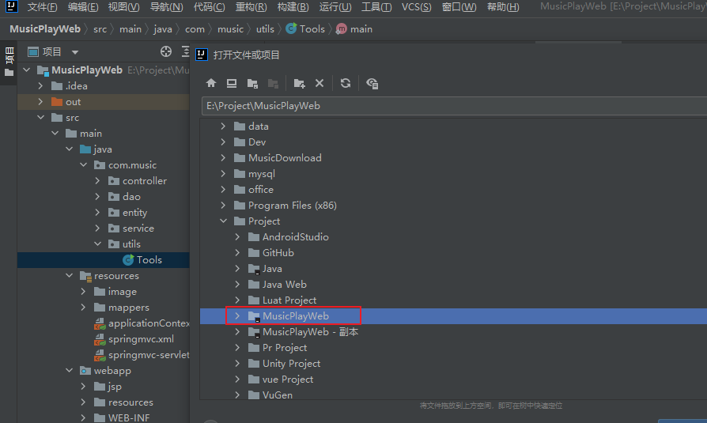
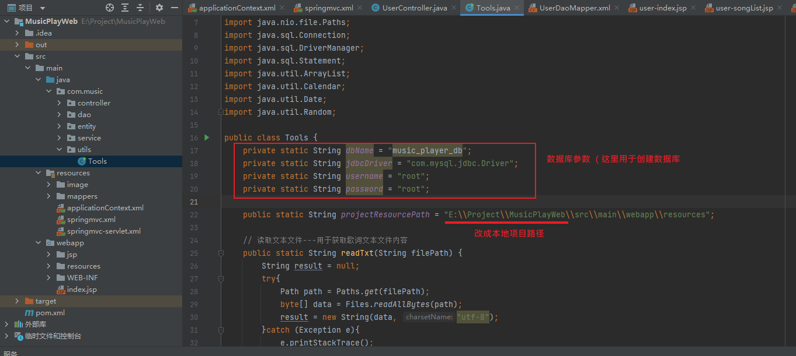
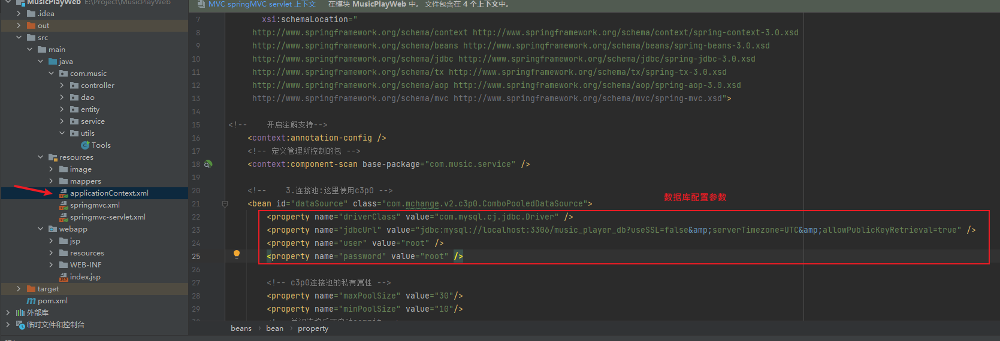
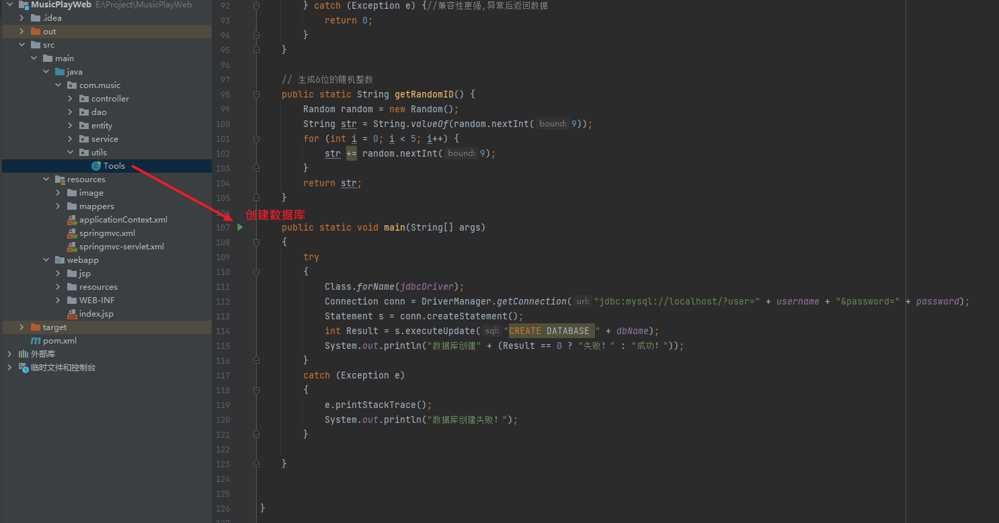
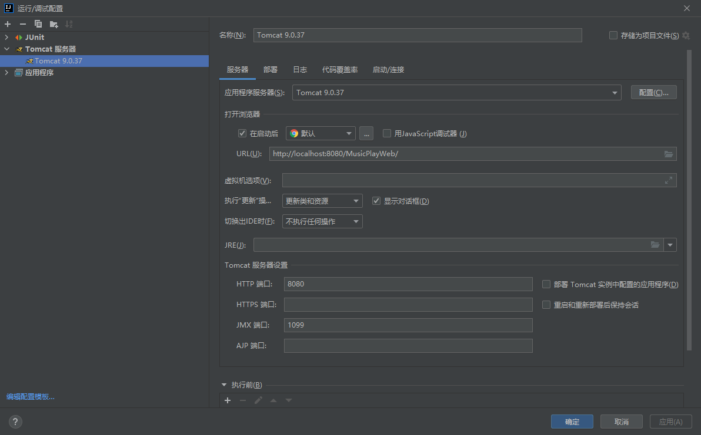
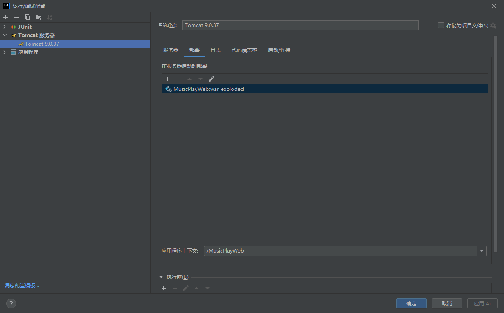
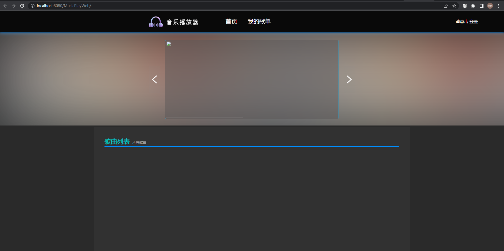
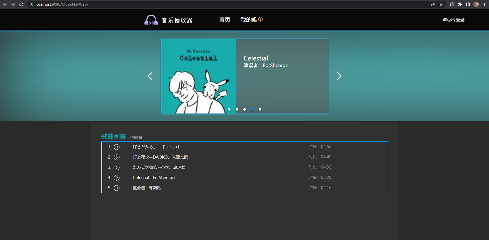

## 项目使用指南

### 准备工作

1.首先下载使用 IDEA 作为开发工具

2.Tomcat 9.0.37版本（最好8.0以上）

### 项目本地化配置

#### 通过IDEA打开该项目，要记得存放路径，还要等待IDEA构建部署项目。

#### 1、Utils/Tools.java

#### 2、applicationContext.xml

### 运行项目

#### 创建数据库

#### Tomcat的参数

启动Tomcat成功后，浏览器访问http://localhost:8080/MusicPlayWeb/ 。初次启动后页面应该是这样的。

点击右上角登录 —> 初始化数据库，初始化成功后会刷新页面，并且显示出歌曲列表与轮播图，如果正确显示出来了，表示你已经将项目成功跑起来了！

## 注意事项

还有很多功能没有完善，或者说不智能，等之后时间长了再修改。比如所有的资源都是已本地化静态资源方式读取的，需要更换的头像、歌曲、歌词、背景图片等等，都要放在"MusicPlayWeb\src\main\webapp\resources\"目录下，存放好之后再重新启动Tomcat部署才有效果。